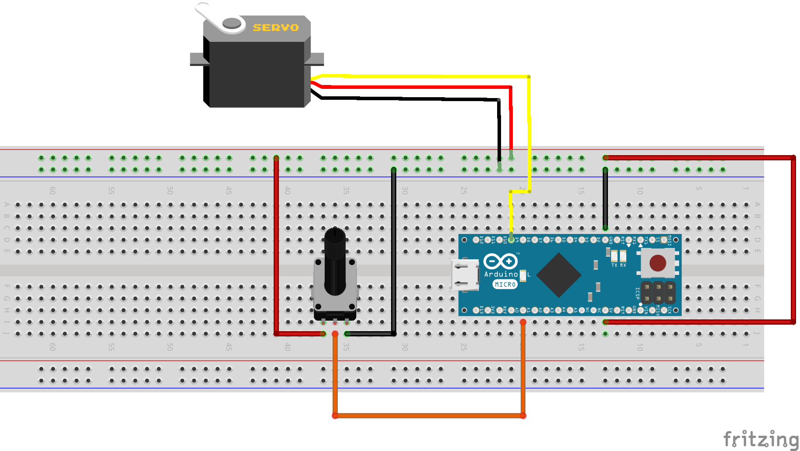
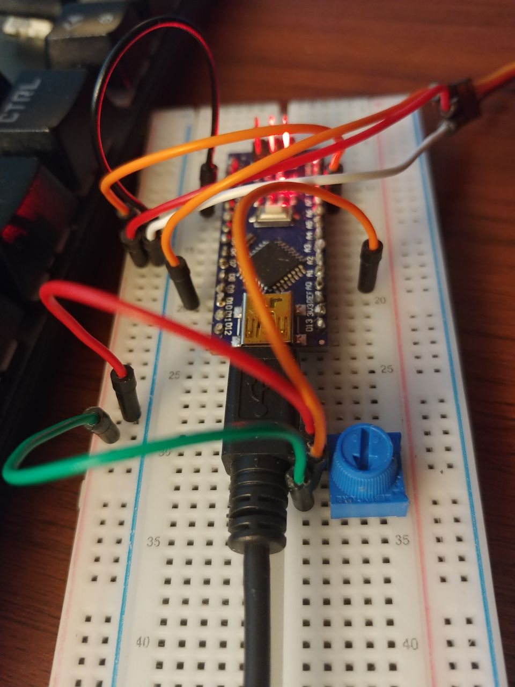
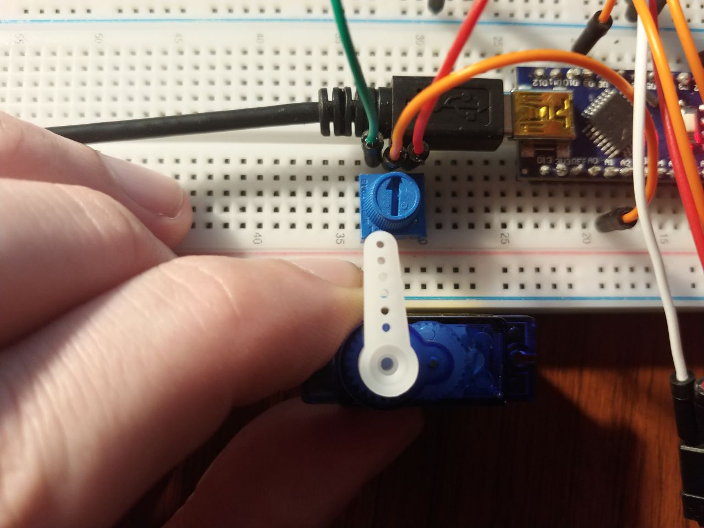
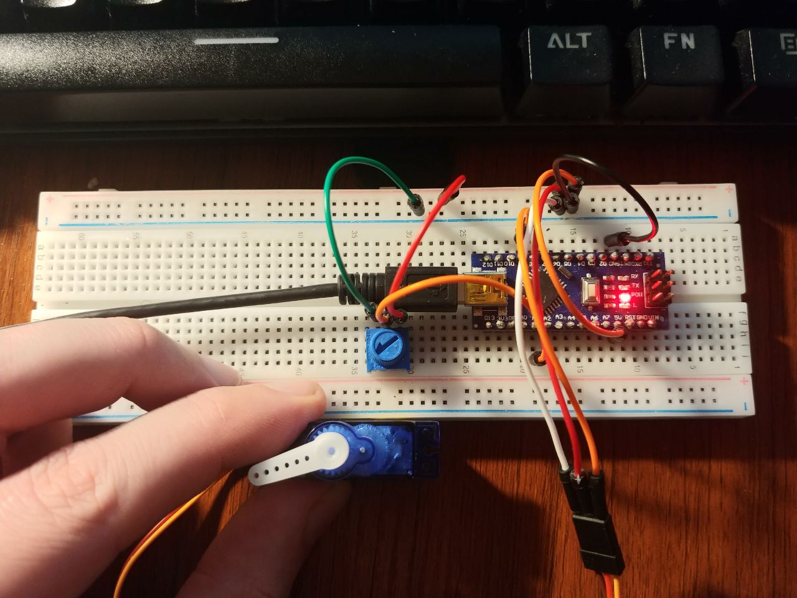

# Servo Potentiometer Control

A simple project which allows you to control the movement of a servo motor with a potentiometer.

## Resources List

• 1 X Arduino Micro or Arduino Uno

• 1 X Servo Motor Operating voltage: 4.8V～6.0V

• 1 X Prototype PCB Board/Breadboard

• 1 X Prototype PCB Board/Breadboard

• 8 X Solderless Flexible Breadboard Jumper Wires

• 1 X Mini USB cable.

• 1 X Potentiometer (3 pin) 

• [The Arduino IDE](https://www.arduino.cc/en/main/software)

## Setup

**A.** Use jumper wires to connect the 5v pin of the Arduino to the breadboards positive rail and the GRD pin to the negative. This will provide the power to the outer rails for the other components.

**B.** To connect to your servo you can simply push one end of the jumper cable into the connector and the other to the breadboard. The positive wire of the servo connects to the positive rail and the negative to the negative rail. The positive will typically be red and the negative will typically be black or brown, refer to your servo's instructions if you're unsure. Finally, connect the last wire (the signal) to pin 9 of your Arduino, this wire will typically be orange, white, or yellow.

